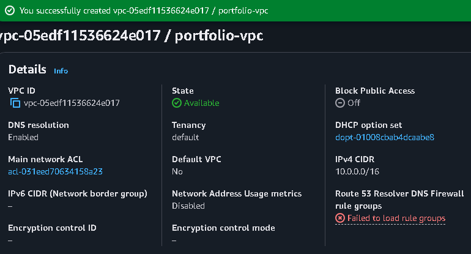
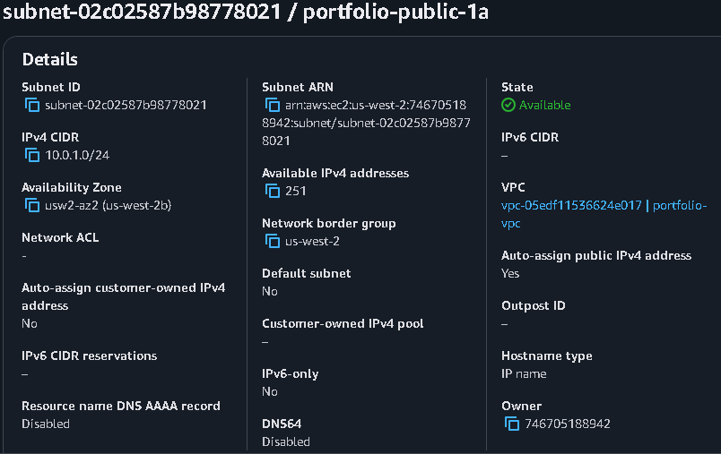
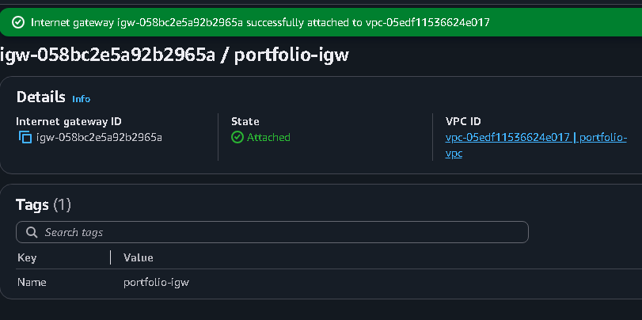
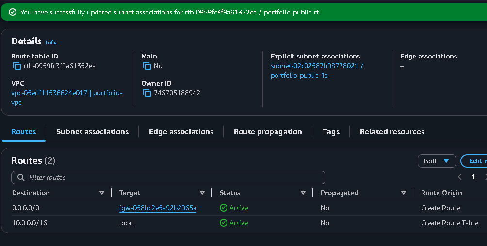
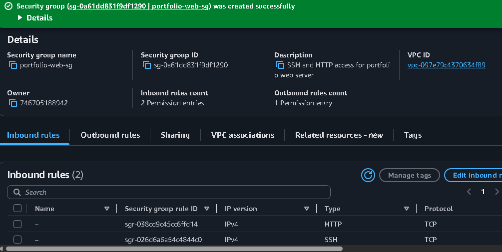
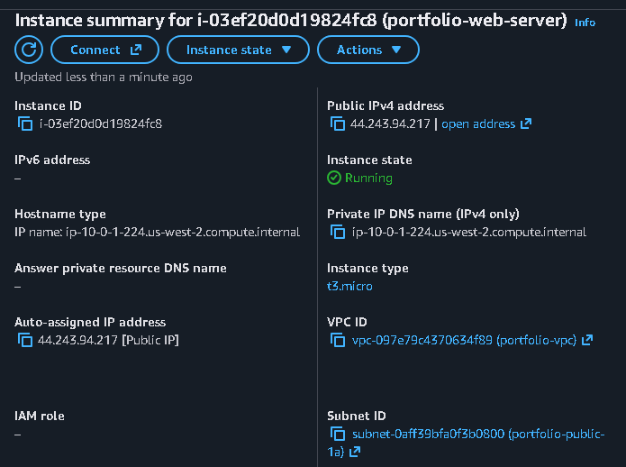
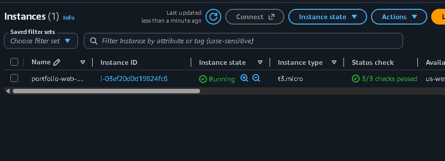

# Amazon EC2 Web Server Deployment

## 📌 Project Overview

This project demonstrates the deployment of a web server on Amazon Web Services (AWS) using an Amazon EC2 instance.

The project was completed as part of my hands-on AWS re/Start cloud learning journey.

The objective was to provision a cloud-based web server, configure the required networking and security components, deploy a web application, and verify that the server could be accessed through the internet.

---

## 🎯 Project Objectives

The main objectives of this project were to:

* Launch an Amazon Linux EC2 instance.
* Create and configure a Virtual Private Cloud (VPC).
* Create a subnet for the EC2 instance.
* Configure an Internet Gateway.
* Configure a security group.
* Assign a public IPv4 address to the instance.
* Install and configure a web server.
* Deploy a simple web application.
* Access the web server through a web browser.
* Test the application's availability.
* Understand the basic architecture of a public-facing AWS workload.

---

## ☁️ AWS Services Used

| AWS Service      | Purpose                                                      |
| ---------------- | ------------------------------------------------------------ |
| Amazon EC2       | Provides the virtual server used to host the web application |
| Amazon VPC       | Provides the isolated virtual networking environment         |
| Amazon EBS       | Provides persistent block storage for the EC2 instance       |
| Security Groups  | Controls inbound and outbound traffic to the instance        |
| Internet Gateway | Provides internet connectivity for the VPC                   |
| Amazon Linux     | Operating system used by the EC2 instance                    |

---

## 🏗️ Architecture

🏗️ Architecture

The following architecture illustrates how internet traffic reaches the EC2 web server through the AWS networking components configured for this project.

flowchart TD
    A[Internet] --> B[Internet Gateway]
    B --> C[AWS VPC]
    C --> D[Public Subnet]
    D --> E[Security Group]
    E --> F[Amazon EC2]
    F --> G[Web Server]
    G --> H[Web Application]
Architecture Components
Component	Role
Internet	Source of requests to the web application
Internet Gateway	Provides connectivity between the VPC and the internet
VPC	Provides the logical network environment
Public Subnet	Hosts the internet-accessible EC2 instance
Security Group	Controls inbound and outbound traffic
Amazon EC2	Provides the virtual computing environment
Web Server	Processes HTTP requests
Web Application	Application delivered to the end user
Request Flow

A typical request follows this path:

Internet
   ↓
Internet Gateway
   ↓
VPC
   ↓
Public Subnet
   ↓
Security Group
   ↓
EC2 Instance
   ↓
Web Server
   ↓
Web Application

This architecture demonstrates the relationship between AWS networking, security, compute, and application delivery.

## 🔧 Implementation

### 1. Create the Networking Environment

A VPC was configured to provide the networking environment for the EC2 instance.

The networking components included:

* VPC
* Public subnet
* Internet Gateway
* Route table
* Route to the internet

The public subnet was configured to support internet connectivity for the web server.

---

### 2. Configure the Security Group

A security group was created for the web server.

The security group controls traffic entering and leaving the EC2 instance.

The required inbound traffic included:

| Type | Protocol | Purpose                                   |
| ---- | -------- | ----------------------------------------- |
| SSH  | TCP      | Remote administration of the Linux server |
| HTTP | TCP      | Access to the web application             |

SSH was used for administrative access, while HTTP allowed users to access the web server through a browser.

---

### 3. Launch the EC2 Instance

An Amazon Linux Amazon Machine Image (AMI) was selected for the server.

The instance was launched using an appropriate burstable EC2 instance type.

The configuration included:

* Amazon Linux AMI
* EC2 instance type
* VPC
* Public subnet
* Security group
* Public IPv4 address
* EBS root volume

---

### 4. Connect to the Server

After the EC2 instance became available, I connected to the Linux server using SSH.

The general connection process was:

```bash
ssh -i <key-file> ec2-user@<public-ip-address>
```

The private key was used to authenticate the connection.

> **Security note:** Private SSH keys and credentials are never uploaded to this repository.

---

### 5. Configure the Web Server

After connecting to the EC2 instance, the server environment was configured to host the web application.

The web server was installed and configured to listen for HTTP requests.

The service was then started and configured to run correctly.

---

### 6. Deploy the Web Application

A web page was deployed to the server's web root directory.

The application was then tested locally on the EC2 instance to verify that the web server was responding correctly.

---

### 7. Test the Application

The EC2 instance's public IPv4 address was entered into a web browser.

Example:

```text
http://<EC2-PUBLIC-IP>
```

The web page successfully loaded when the networking and security configuration was correct.

---

## 🧪 Testing and Validation

The deployment was validated by checking:

* EC2 instance status
* Instance system checks
* Public IPv4 address
* Security group configuration
* Web server status
* HTTP connectivity
* Browser accessibility

Successful browser access confirmed that traffic could travel from the internet through the VPC to the EC2 web server.

---

## 🔐 Security Considerations

This project introduced several fundamental AWS security concepts.

### Security Groups

Security groups act as virtual firewalls for EC2 instances.

Only required network traffic should be allowed.

### SSH Security

SSH provides administrative access to the Linux server.

Private keys must be protected and should never be committed to GitHub.

### Public Exposure

Because this project uses a public-facing web server, HTTP traffic is intentionally exposed to allow browser access.

For production environments, additional security controls should be considered, including:

* Restricting administrative access
* HTTPS/TLS
* IAM best practices
* Network segmentation
* Monitoring and logging
* Principle of least privilege

---

## 🛠️ Troubleshooting

During AWS hands-on labs, cloud infrastructure can fail because of incorrect configuration rather than a problem with the application itself.

Important troubleshooting areas for this project include:

### EC2 Connectivity

If SSH does not connect:

1. Confirm that the EC2 instance is running.
2. Confirm that the correct public IPv4 address is being used.
3. Confirm that the private key is correct.
4. Check security group inbound rules.
5. Confirm that the subnet has appropriate routing.
6. Confirm that the instance has internet connectivity.

### Web Server Connectivity

If the web page cannot be reached:

1. Verify that the web server is running.
2. Confirm that HTTP traffic is allowed by the security group.
3. Check the server's listening port.
4. Verify the public IPv4 address.
5. Check the VPC route configuration.
6. Test connectivity from the EC2 instance.

---

## 📸 Screenshots


## 📸 Screenshots

The following screenshots provide visual evidence of the AWS infrastructure, configuration, server deployment, and successful web application access.

### 1. VPC Configuration

The VPC provides the isolated networking environment in which the EC2 web server was deployed.



---

### 2. Subnet Configuration

The subnet provides the network segment within the VPC where the EC2 instance was deployed.



---

### 3. Internet Gateway

The Internet Gateway provides a path for communication between the VPC and the internet.



---

### 4. Route Table

The route table determines how traffic from the subnet is routed. The internet route allows the public-facing workload to communicate with the internet.



---

### 5. Security Group Inbound Rules

The security group controls inbound network traffic to the EC2 instance. The configured rules allow the traffic required for administration and web access.



---

### 6. EC2 Instance Configuration

This screenshot shows the deployed EC2 instance and its associated configuration, including the instance type, networking information, and public addressing.



---

### 7. EC2 Running Status

The EC2 instance is shown in a running state, confirming that the virtual server was successfully provisioned.



---

### 8. SSH Connection

The Linux server was accessed remotely using SSH, demonstrating successful administrative connectivity to the EC2 instance.


---

### 9. Web Server Configuration

This screenshot provides evidence that the web server was configured and running on the EC2 instance.


---

### 10. Website in Browser

The final test confirms that the web application was successfully deployed and could be accessed through the EC2 instance's public endpoint.


## 🧠 Key Concepts Learned

This project strengthened my understanding of:

* Cloud computing
* Infrastructure provisioning
* Amazon EC2
* Virtual machines
* VPC networking
* Public and private networking concepts
* Subnets
* Internet Gateways
* Route tables
* Security Groups
* Linux server administration
* Web server deployment
* SSH
* Public IPv4 addressing
* Basic cloud troubleshooting

---

## 📚 AWS Cloud Practitioner Concepts Demonstrated

This project connects directly to several AWS Cloud Practitioner knowledge areas.

### Compute

Amazon EC2 provides scalable virtual computing capacity in AWS.

### Networking

Amazon VPC provides the networking foundation for AWS resources.

### Security

Security Groups control network traffic to and from EC2 instances.

### Storage

Amazon EBS provides block-level storage associated with the EC2 instance.

### Availability

AWS infrastructure can be designed to provide scalable and highly available applications.

### Shared Responsibility Model

AWS manages the security of the underlying cloud infrastructure, while the customer remains responsible for appropriate configuration and security of resources deployed in the cloud.

---

## 💼 Professional Skills Demonstrated

This project demonstrates practical exposure to:

* Cloud infrastructure deployment
* AWS resource configuration
* Linux administration
* Network configuration
* Security configuration
* Web server deployment
* Cloud troubleshooting
* Technical documentation
* Infrastructure management

---

## 🚀 Future Improvements

A production-oriented version of this project could be enhanced by implementing:

* HTTPS using TLS
* Application Load Balancer
* EC2 Auto Scaling
* Amazon CloudWatch monitoring
* Route 53 DNS
* IAM roles
* AWS Systems Manager
* Infrastructure as Code using CloudFormation
* Multi-AZ architecture

These improvements would increase the project's scalability, availability, security, and operational visibility.

---

## 📊 Project Status

**Status:** ✅ Completed

**Learning Path:** AWS re/Start

**Portfolio Category:** Cloud Computing / AWS

**Primary Service:** Amazon EC2

