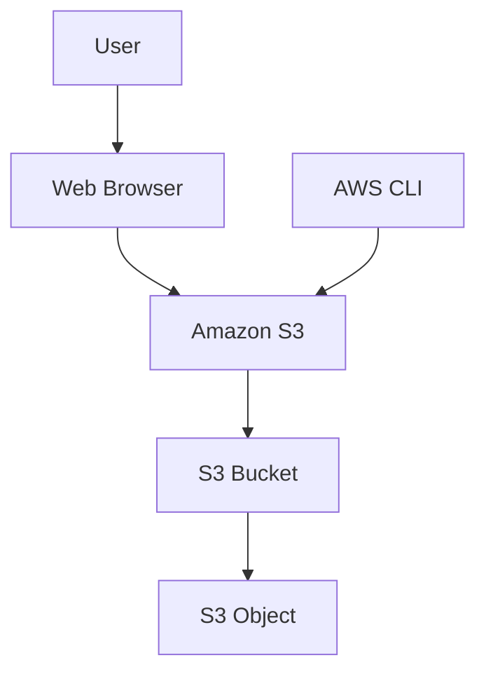
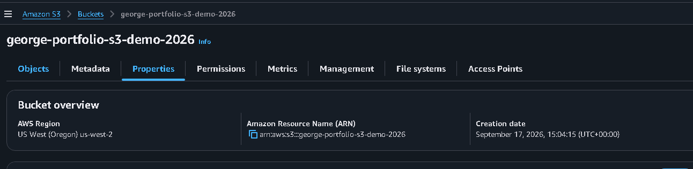
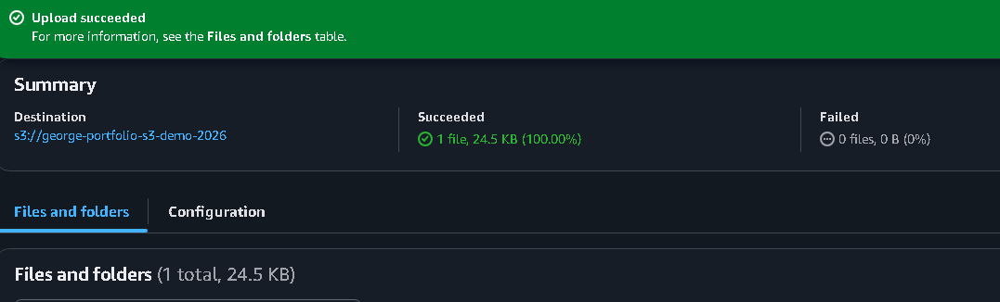
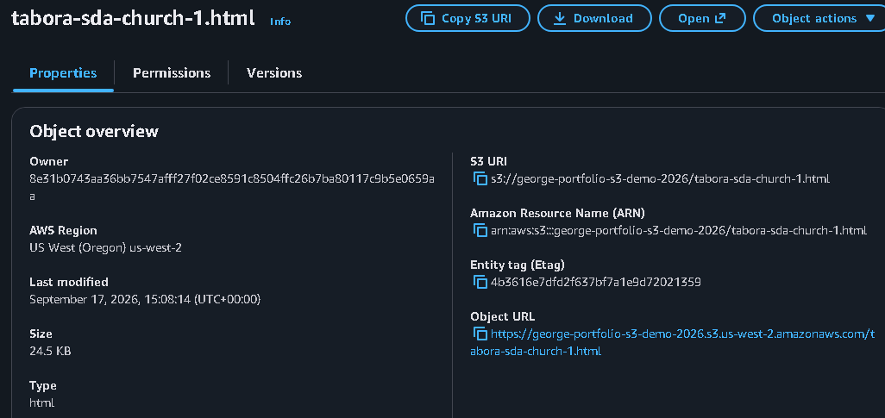
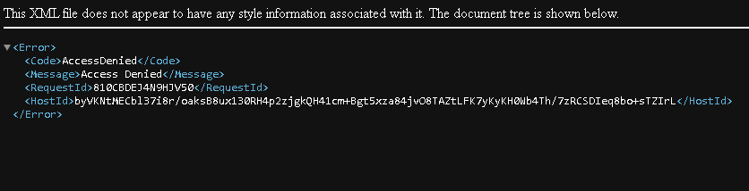
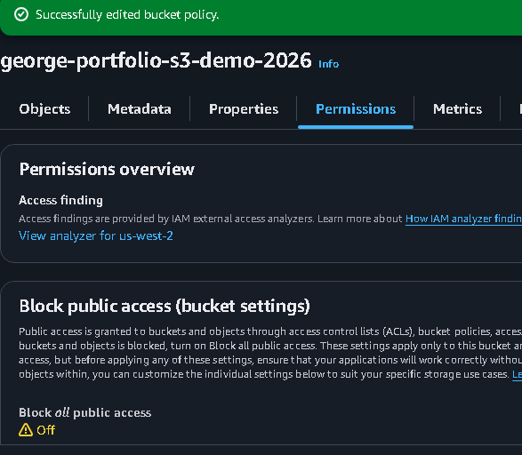
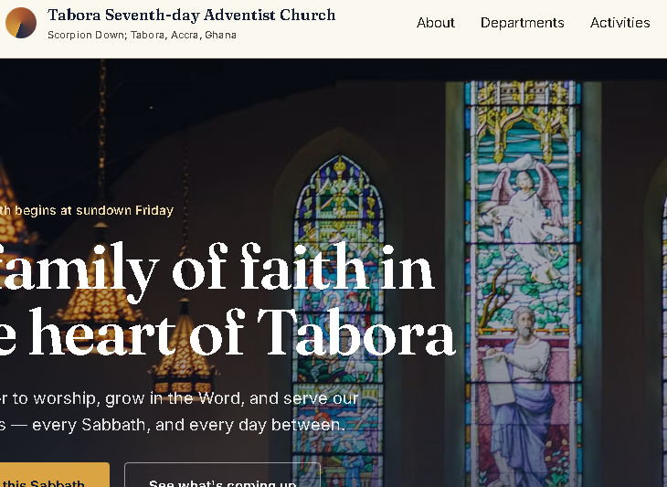
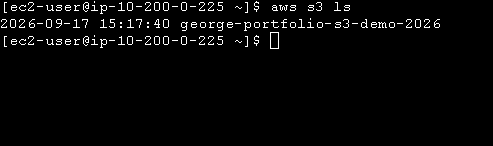
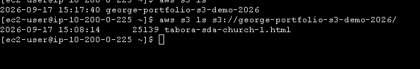

# Amazon S3 Storage & Object Management

> **AWS Cloud Practitioner Portfolio Project**
> Hands-on experience creating an Amazon S3 bucket, managing objects, configuring object access, and using the AWS CLI to interact with S3.

## 📌 Project Overview

This project demonstrates the use of Amazon Simple Storage Service (Amazon S3) to store and manage objects in the AWS cloud.

The project was completed as part of my AWS re/Start hands-on cloud learning journey.

The objective was to create an S3 bucket, upload an object, test object access, configure the object for public access as required by the lab, access it through a web browser, and manage the bucket using the AWS Command Line Interface (CLI).

---

## 🎯 Project Objectives

The main objectives were to:

* Create an Amazon S3 bucket.
* Upload an object to the bucket.
* Attempt to access the object through a web browser.
* Configure the object for public access as required by the lab.
* Access the object through a browser after configuration.
* List bucket contents using the AWS CLI.
* Understand S3 object storage and access control.
* Practice basic AWS CLI commands.

---

## ☁️ AWS Services and Tools

| Service / Tool | Purpose                                            |
| -------------- | -------------------------------------------------- |
| Amazon S3      | Object storage                                     |
| AWS CLI        | Command-line management of S3 resources            |
| IAM            | Authentication and authorization for AWS resources |
| Web Browser    | Testing object accessibility                       |

---

## 🏗️ Architecture



### Architecture Components

| Component   | Role                                  |
| ----------- | ------------------------------------- |
| User        | Initiates storage and access requests |
| Web Browser | Used to test object accessibility     |
| Amazon S3   | Provides scalable object storage      |
| S3 Bucket   | Container for stored objects          |
| S3 Object   | File stored inside the bucket         |
| AWS CLI     | Provides command-line access to S3    |

---

## 🔧 Implementation

### 1. Create an S3 Bucket

An S3 bucket was created to provide a storage location for the project object.

The bucket name was configured according to AWS S3 naming requirements.

S3 bucket names must be globally unique.

---

### 2. Upload an Object

An object was uploaded to the S3 bucket.

The object represents the data being stored in Amazon S3.

The S3 object consists of:

* Object data
* Object key
* Metadata

---

### 3. Test Object Access

After uploading the object, I attempted to access it through a web browser.

This test demonstrated the difference between storing an object and having permission to access that object.

---

### 4. Configure Object Access

The object was configured for public access as required by the lab.

This allowed the object to be accessed through its S3 object URL.

> **Security note:** Public access should only be enabled when there is a specific requirement for it. Production applications should normally use more controlled access mechanisms.

---

### 5. Access the Object Through a Browser

The object's URL was opened in a web browser after the required access configuration was completed.

Successful access confirmed that the object could be retrieved through the configured endpoint.

https://tabora-sda.s3.us-west-2.amazonaws.com/tabora-sda-church-1.html

## 💻 AWS CLI

The AWS CLI was used to interact with the S3 bucket.

### List S3 Buckets

```bash
aws s3 ls
```

This command lists the S3 buckets accessible to the authenticated AWS identity.

### List Objects in the Bucket

```bash
aws s3 ls s3://BUCKET-NAME
```

Replace `BUCKET-NAME` with the actual bucket name.

The command displays the objects stored in the specified bucket.

---

## 🧪 Testing and Validation

The project was validated through several tests:

* S3 bucket creation
* Object upload
* Browser access attempt
* Object access configuration
* Successful browser access
* AWS CLI bucket listing
* AWS CLI object listing

These tests demonstrated the basic lifecycle of an object stored in Amazon S3.

---

## 🔐 Security Considerations

Amazon S3 provides several mechanisms for controlling access to stored data.

Important considerations include:

* Bucket policies
* IAM policies
* Object permissions
* S3 Block Public Access
* Encryption
* Least-privilege access

Public access should be carefully controlled because making an object publicly accessible can expose its contents to anyone who has access to the public URL.

For production workloads, access should generally be restricted unless public distribution is an intentional requirement.

---

## 📸 Screenshots


The following screenshots provide evidence of the S3 bucket creation, object management, access configuration, browser testing, and AWS CLI operations completed during the project.

### 1. S3 Bucket

The S3 bucket was successfully created and configured as the storage container for the project object.



---

### 2. Bucket Contents

The bucket contents show the object stored within Amazon S3.



---

### 3. Uploaded Object

This screenshot provides evidence that the required file was successfully uploaded as an S3 object.



---

### 4. Initial Browser Access

The initial browser test demonstrates the access state of the object before the required access configuration was completed.



---

### 5. Object Access Configuration

This screenshot shows the access configuration applied to the S3 object as required by the lab.




### 6. Successful Browser Access

After the required configuration, the object was successfully accessed through a web browser.



https://tabora-sda.s3.us-west-2.amazonaws.com/tabora-sda-church-1.html

### 7. AWS CLI Bucket Listing

The AWS CLI was used to list the S3 buckets available to the authenticated AWS identity.



---

### 8. AWS CLI Object Listing

The AWS CLI was used to list the objects stored in the project bucket.




## 🧠 Key Concepts Learned

This project strengthened my understanding of:

* Object storage
* Amazon S3 buckets
* S3 objects
* Object keys
* Bucket naming
* Object accessibility
* Access permissions
* Public versus private objects
* AWS CLI
* Basic cloud storage management
* AWS security principles

---

## 📚 AWS Cloud Practitioner Concepts Demonstrated

### Storage

Amazon S3 provides highly scalable object storage for data stored as objects within buckets.

### Security

S3 access can be controlled through AWS identity and resource-based permissions.

### Durability and Availability

Amazon S3 is designed for highly durable object storage and is commonly used for backup, data storage, static content, and other workloads.

### Shared Responsibility

AWS manages security of the underlying cloud infrastructure, while customers are responsible for configuring access to their S3 resources appropriately.

---

## 💼 Skills Demonstrated

### AWS

* Amazon S3
* Object storage
* Access control
* Cloud security fundamentals

### Command Line

* AWS CLI
* S3 resource management
* Command-line verification

### Professional Skills

* Cloud resource configuration
* Testing and validation
* Security awareness
* Technical documentation
* Troubleshooting

---

## 🚀 Future Improvements

A production-oriented S3 solution could be enhanced using:

* S3 Versioning
* S3 Lifecycle Rules
* Server-side encryption
* IAM least-privilege policies
* S3 Event Notifications
* CloudFront
* Static website hosting
* CloudWatch monitoring
* Cross-region replication

---

## 📊 Project Status

**Status:** ✅ Completed

**Learning Path:** AWS re/Start

**Portfolio Category:** Cloud Computing / AWS

**Primary Service:** Amazon S3
