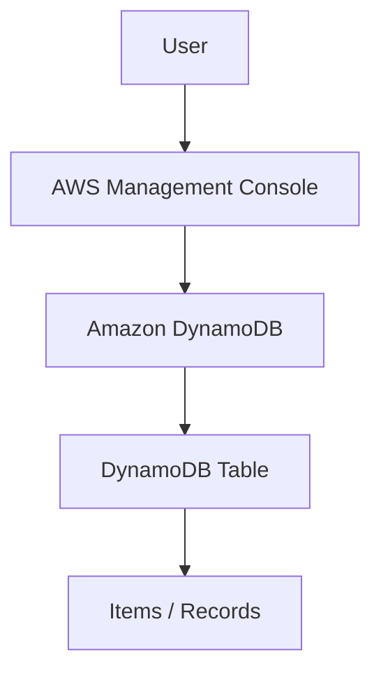

# Amazon DynamoDB Table Management

> **AWS Cloud Practitioner Portfolio Project**
> Hands-on experience creating a DynamoDB table, adding records, querying data, and managing the table lifecycle.

## 📌 Project Overview

This project demonstrates the use of Amazon DynamoDB, a fully managed NoSQL database service provided by AWS.

The project was completed as part of my AWS re/Start hands-on cloud learning journey.

The objective was to create a DynamoDB table, add data to the table, query the stored records, and delete the table after completing the exercise.

---

## 🎯 Project Objectives

The main objectives were to:

* Create a DynamoDB table.
* Configure a primary key.
* Add items to the table.
* Query the table.
* Verify stored records.
* Delete the DynamoDB table.
* Understand the basic concepts of NoSQL databases.

---

## ☁️ AWS Service Used

| AWS Service     | Purpose                                 |
| --------------- | --------------------------------------- |
| Amazon DynamoDB | Provides a fully managed NoSQL database |

---

## 🏗️ Architecture



### Architecture Components

| Component              | Role                                    |
| ---------------------- | --------------------------------------- |
| User                   | Performs database management operations |
| AWS Management Console | Interface used to configure DynamoDB    |
| DynamoDB               | Managed NoSQL database service          |
| Table                  | Stores related items                    |
| Item                   | Individual record stored in the table   |
| Primary Key            | Uniquely identifies items in the table  |

---

## 🔧 Implementation

### 1. Create the DynamoDB Table

A DynamoDB table was created through the AWS Management Console.

The table was configured with a primary key to uniquely identify the records.

The primary key is an important component of DynamoDB because it determines how items are uniquely identified and accessed.

---

### 2. Add Items

After creating the table, records were added to DynamoDB.

Each item consisted of attributes containing the data associated with that record.

Example structure:

```text
Item
├── Primary Key
├── Attribute 1
├── Attribute 2
└── Attribute 3
```

The actual attributes used in the lab are shown in the project screenshots.

---

### 3. Query the Table

The table was queried to retrieve stored items.

The query operation demonstrated how DynamoDB can retrieve data using the table's key structure.

The returned records were inspected to verify that the data had been successfully stored.

---

### 4. Verify the Data

The stored items were reviewed in the DynamoDB console.

This confirmed that:

* The table existed.
* Items were successfully created.
* The primary key was functioning as expected.
* Records could be retrieved.

---

### 5. Delete the Table

After completing the exercise, the DynamoDB table was deleted.

This demonstrated the basic lifecycle of a DynamoDB resource:

```text
Create
   ↓
Add Data
   ↓
Query Data
   ↓
Verify
   ↓
Delete
```

---

## 🧪 Testing and Validation

The project was validated through the following operations:

* Table creation
* Primary key configuration
* Item creation
* Data retrieval
* Query testing
* Table deletion

Successful completion of these operations demonstrated basic hands-on knowledge of DynamoDB.

---

## 🔐 Security and Data Management Considerations

DynamoDB integrates with AWS security services such as IAM to control access to database resources.

Important considerations for production workloads include:

* IAM permissions
* Least-privilege access
* Encryption
* Backup and recovery
* Point-in-time recovery
* Monitoring
* Appropriate table capacity configuration

Database permissions should be restricted to the actions required by each user, application, or role.

---

## 📸 Screenshots

Screenshots from the completed DynamoDB lab will be added here.

Planned evidence includes:

1. DynamoDB table creation
2. Table configuration
3. Added items
4. Query results
5. Table deletion

Screenshots will be stored in:

```text
screenshots/
```

---

## 🧠 Key Concepts Learned

This project strengthened my understanding of:

* NoSQL databases
* Amazon DynamoDB
* Tables
* Items
* Attributes
* Primary keys
* Data retrieval
* Database resource lifecycle
* Managed AWS database services

---

## 📚 AWS Cloud Practitioner Concepts Demonstrated

### Database Services

DynamoDB is a managed NoSQL database service designed for applications requiring scalable and low-latency data access.

### Managed Services

AWS manages much of the underlying infrastructure required to operate the database service, reducing the need to administer database servers directly.

### Security

Access to DynamoDB resources can be controlled through AWS Identity and Access Management (IAM).

### Scalability

DynamoDB is designed to scale with application workloads without requiring traditional database server management.

---

## 💼 Skills Demonstrated

### AWS

* Amazon DynamoDB
* NoSQL database fundamentals
* AWS resource management
* Database lifecycle management

### Data

* Data creation
* Data retrieval
* Primary key concepts
* Record management

### Professional Skills

* Cloud resource configuration
* Database testing
* Technical documentation
* AWS service analysis
* Cloud troubleshooting

---

## 🚀 Future Improvements

A production DynamoDB implementation could be enhanced using:

* AWS SDK integration
* DynamoDB Streams
* Lambda triggers
* Global Tables
* Point-in-time recovery
* CloudWatch monitoring
* IAM least-privilege policies
* Infrastructure as Code

---

## 📊 Project Status

**Status:** ✅ Completed

**Learning Path:** AWS re/Start

**Portfolio Category:** Cloud Computing / Databases

**Primary Service:** Amazon DynamoDB
