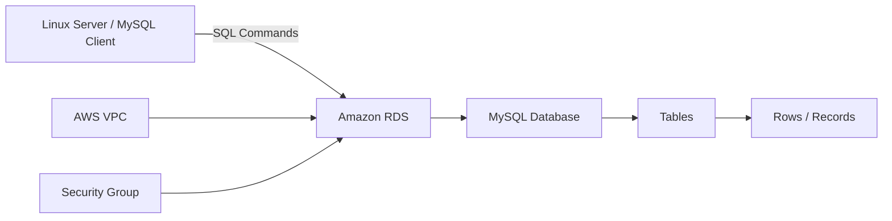
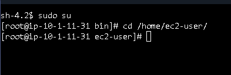
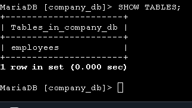
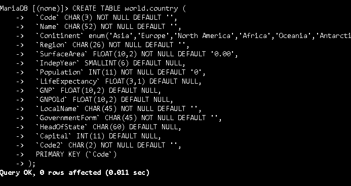
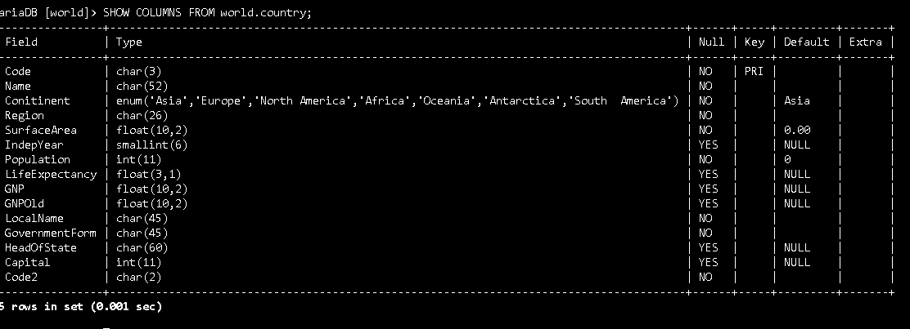
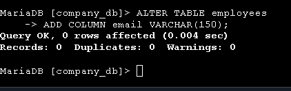
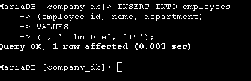
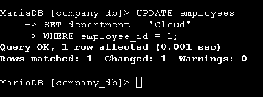
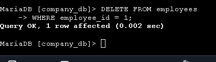
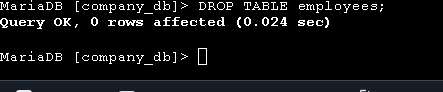

# Project 04 — Amazon RDS MySQL Database Management

## Project Overview

This project demonstrates practical **MySQL database management and SQL operations** using **Amazon Relational Database Service (Amazon RDS)**.

The project was completed as part of an **AWS re/Start hands-on lab**. The lab provided practical experience working with a MySQL relational database hosted on Amazon RDS and performing common database administration tasks using SQL statements.

The project covers database and table creation, viewing database structures, modifying tables, inserting and modifying records, deleting records, dropping database objects, and importing data from a database backup.

---

## Objectives

The objectives of this project were to:

- Use the `CREATE` statement to create databases and tables.
- Use the `SHOW` statement to view available databases and tables.
- Use the `ALTER` statement to alter the structure of a table.
- Use the `INSERT` statement to insert rows into a table.
- Use the `UPDATE` statement to update existing rows.
- Use the `DELETE` statement to delete rows from a table.
- Use the `DROP` statement to delete databases and tables.
- Import rows from a database backup file.
- Connect to and manage a MySQL database hosted on Amazon RDS.
- Understand the relationship between an AWS managed database service and SQL-based database administration.

---

## AWS Services and Technologies

| Technology | Purpose |
|---|---|
| **Amazon RDS** | Managed relational database hosting |
| **MySQL** | Relational database engine |
| **Amazon VPC** | Network environment for AWS resources |
| **Security Groups** | Network access control |
| **Amazon EC2 / Linux Server** | Environment used to connect to the database |
| **MySQL Client** | Command-line database management |
| **SQL** | Database creation and data-management operations |

---

## Architecture



### Architecture Components

**Amazon RDS**

Provides the managed relational database environment.

**MySQL**

The relational database engine used for the project.

**MySQL Client**

Used to connect to the RDS database and execute SQL commands.

**SQL**

Used to create and manage databases, tables, and records.

**VPC and Security Group**

Provide the networking environment and access control required for database connectivity.

---

# SQL Operations Performed

## 1. CREATE — Create a Database

The `CREATE DATABASE` statement was used to create a new database.

```sql
CREATE DATABASE database_name;
```

This demonstrates the ability to create a logical database within the MySQL environment.

---

## 2. CREATE — Create a Table

After creating the database, a table was created using the `CREATE TABLE` statement.

```sql
CREATE TABLE table_name (
    id INT PRIMARY KEY,
    name VARCHAR(100)
);
```

A table consists of columns that define the structure of the data and rows that contain individual records.

---

## 3. SHOW — View Databases and Tables

The `SHOW` statement was used to inspect the database environment.

### View available databases

```sql
SHOW DATABASES;
```

### View tables

```sql
SHOW TABLES;
```

These commands demonstrate how to inspect available database objects.

---

## 4. ALTER — Modify Table Structure

The `ALTER TABLE` statement was used to change the structure of an existing table.

For example:

```sql
ALTER TABLE table_name
ADD COLUMN email VARCHAR(100);
```

The `ALTER` operation demonstrates that table structures can be modified after they have been created.

---

## 5. INSERT — Add Rows

The `INSERT` statement was used to add records to a table.

```sql
INSERT INTO table_name
(id, name)
VALUES
(1, 'Example');
```

Multiple records can also be inserted using appropriate SQL syntax.

---

## 6. UPDATE — Modify Rows

The `UPDATE` statement was used to modify existing records.

```sql
UPDATE table_name
SET name = 'Updated Name'
WHERE id = 1;
```

The `WHERE` clause is important because it identifies the records that should be modified.

---

## 7. DELETE — Remove Rows

The `DELETE` statement was used to remove records from a table.

```sql
DELETE FROM table_name
WHERE id = 1;
```

Using an appropriate `WHERE` condition helps prevent unintended deletion of multiple records.

---

## 8. DROP — Delete Database Objects

The `DROP` statement was used to remove database objects.

### Drop a table

```sql
DROP TABLE table_name;
```

### Drop a database

```sql
DROP DATABASE database_name;
```

The `DROP` operation permanently removes the specified database object and should therefore be used carefully.

---

## 9. Import Database Backup

The project also included importing rows from a database backup file.

A MySQL backup can contain SQL statements that recreate database structures and/or insert data.

A typical import operation can be performed from the command line using:

```bash
mysql -h <RDS-ENDPOINT> -u <USERNAME> -p <DATABASE_NAME> < backup.sql
```

The command connects to the RDS MySQL instance and processes the SQL statements contained in the backup file.

---

# Database Management Workflow

The overall workflow demonstrated in this project was:

```text
Create Database
       ↓
Create Table
       ↓
Show Database / Tables
       ↓
Alter Table
       ↓
Insert Rows
       ↓
Update Rows
       ↓
Delete Rows
       ↓
Import Backup Data
       ↓
Drop Database Objects
```

This represents a practical database-management lifecycle using SQL.

---

# Amazon RDS Configuration

Amazon RDS was used as the managed database platform for the project.

The RDS environment provided:

- Managed MySQL database infrastructure
- Database endpoint
- Database networking
- Security-group integration
- Managed database storage
- AWS resource management

The project therefore combined **AWS cloud infrastructure knowledge** with **relational database and SQL skills**.

---

# Connectivity and Troubleshooting

Database connectivity was an important part of the lab.

The connection process required checking several layers:

```text
Linux Server
      ↓
Network Connectivity
      ↓
Security Group
      ↓
TCP Port 3306
      ↓
RDS Endpoint
      ↓
MySQL Authentication
      ↓
Database
```

Troubleshooting included investigating network connectivity, database accessibility, and authentication.

One of the practical lessons from the lab was that a database connection problem can occur at different layers. A failed connection therefore needs to be investigated systematically rather than assuming that the database itself is unavailable.

---

# Security Considerations

Database security is an important consideration when working with Amazon RDS.

The project demonstrated the importance of:

- Controlling access through security groups.
- Protecting database credentials.
- Restricting database access to authorized resources.
- Using appropriate network rules.
- Applying least-privilege access.
- Avoiding unnecessary public database exposure.
- Using encryption and backups for production workloads.
- Protecting database backup files.

The configuration used in this project was primarily for hands-on learning and should be reviewed and hardened before being used in a production environment.

---

# Key Concepts Learned

### Relational Databases

MySQL stores structured information in tables consisting of rows and columns.

### SQL

SQL provides commands for creating, inspecting, modifying, and deleting database objects and data.

### Amazon RDS

RDS provides a managed environment for running relational database engines in AWS.

### Database Schema

The structure of tables, columns, data types, and relationships defines the database schema.

### CRUD Operations

The project included the core data-management operations:

- **Create** — `INSERT`
- **Read** — viewing/querying data
- **Update** — `UPDATE`
- **Delete** — `DELETE`

It also covered database-definition operations such as `CREATE`, `ALTER`, and `DROP`.

---

# AWS Cloud Practitioner Concepts

This project demonstrates practical understanding of:

- Amazon RDS
- Managed database services
- Relational databases
- MySQL
- SQL
- VPC networking
- Security groups
- Database connectivity
- Cloud resource management
- Data management
- Backup and recovery concepts
- AWS security

---

# Professional Skills Demonstrated

- SQL database management
- MySQL administration
- Amazon RDS configuration
- Cloud database management
- Linux command-line usage
- Database troubleshooting
- Network troubleshooting
- Data manipulation
- Backup/import operations
- Technical documentation
- AWS cloud fundamentals

---

# Screenshots

The following screenshots document the practical work completed during the lab.

### 1. Amazon RDS Instance



### 2. Create Database



### 3. Create Table



### 4. Show Databases and Tables



### 5. Alter Table



### 6. Insert Rows



### 7. Update Rows



### 8. Delete Rows



### 9. Drop Table and Database



### 10. Import Database Backup


---

# Lessons Learned

This project provided practical experience with both **cloud database infrastructure and SQL database administration**.

Key lessons included:

1. Amazon RDS provides a managed platform for relational databases.
2. SQL can be used to manage database structures and data.
3. Database operations can be divided into database-definition and data-manipulation tasks.
4. Network configuration and security groups affect database connectivity.
5. Database backups can be used to restore or import data.
6. Careful use of `UPDATE`, `DELETE`, and `DROP` is important because these commands can modify or remove data and database objects.

---

# Future Improvements

Future versions of this project could include:

- Automated RDS deployment using AWS CloudFormation.
- Amazon RDS automated backups.
- Point-in-Time Recovery.
- Encryption at rest and in transit.
- AWS Secrets Manager for database credentials.
- CloudWatch monitoring.
- Multi-AZ database deployment.
- Database performance monitoring.
- More advanced SQL queries.
- Joins and relational data analysis.
- Stored procedures and views.
- Database access using Python applications.

---

# Project Status

**Completed**

This project demonstrates hands-on experience with **Amazon RDS, MySQL, SQL database management, data manipulation, database backup/import operations, networking, and cloud troubleshooting**.
