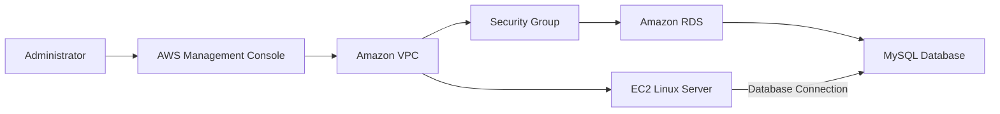

# Project 04 — Amazon RDS MySQL Database

## Project Overview

This project demonstrates the deployment and configuration of a managed relational database using **Amazon Relational Database Service (Amazon RDS)**.

The project was completed as part of an **AWS re/Start hands-on lab** and focused on launching an Amazon RDS database instance, configuring networking and security, and validating connectivity from an Amazon Linux server.

The lab provided practical experience with managed database services, database connectivity, security groups, VPC networking, and AWS resource configuration.

---

## Objectives

The objectives of this project were to:

* Create an Amazon RDS database instance.
* Configure a MySQL relational database.
* Deploy the database within the provided VPC.
* Configure security group access for the Linux server.
* Configure appropriate database instance settings.
* Connect to the RDS database from a Linux server.
* Test database connectivity.
* Troubleshoot connectivity and authentication issues.
* Understand the role of Amazon RDS as a managed database service.

---

## AWS Services Used

| Service                    | Purpose                                                     |
| -------------------------- | ----------------------------------------------------------- |
| **Amazon RDS**             | Managed relational database service                         |
| **MySQL**                  | Relational database engine                                  |
| **Amazon VPC**             | Provides the network environment                            |
| **Security Groups**        | Controls inbound and outbound network traffic               |
| **Amazon EC2**             | Linux server used to test database connectivity             |
| **Amazon CloudWatch**      | AWS monitoring capability associated with managed resources |
| **AWS Management Console** | Resource configuration and management                       |

---

## Architecture



### Architecture Components

**Amazon VPC**

Provides the network environment in which the AWS resources operate.

**Amazon EC2 Linux Server**

Used as the client/server environment from which the RDS database connection was tested.

**Security Group**

Controls network traffic between the Linux server and the RDS database.

**Amazon RDS**

Provides a managed relational database environment without requiring the database server infrastructure to be managed manually.

**MySQL**

The relational database engine used for the lab.

---

## Implementation

### 1. Create the RDS Database

An Amazon RDS database instance was created through the AWS Management Console.

The configuration included:

* MySQL database engine
* Appropriate lab-supported database template
* Burstable DB instance class
* General Purpose storage
* Lab VPC
* Appropriate security group
* On-Demand pricing
* No standby instance

The database credentials were recorded securely for use during the connectivity test.

---

### 2. Configure Networking

The RDS instance was associated with the lab VPC.

Network configuration was important because the Linux server needed network access to the database.

The database security group was configured to permit the required traffic from the Linux server.

---

### 3. Configure Security Group Access

The security group was configured to allow the Linux server to communicate with the MySQL database.

The relevant MySQL port is:

```text
TCP 3306
```

The source was restricted to the appropriate lab resource/security group rather than unnecessarily allowing database access from everywhere.

---

### 4. Configure Additional Settings

For the MySQL configuration, Enhanced Monitoring was disabled as required by the lab instructions.

The database was configured using the available lab-supported settings rather than production-scale infrastructure.

---

### 5. Test Database Connectivity

After the RDS instance became available, connectivity was tested from the Linux server.

The general connection process was:

```bash
mysql -h <RDS-ENDPOINT> -P 3306 -u <USERNAME> -p
```

The RDS endpoint provided by AWS was used as the database host.

The password was entered when prompted.

---

## Testing and Validation

The database deployment was validated by checking:

* RDS instance status
* Database endpoint availability
* Security group configuration
* Network connectivity
* MySQL port accessibility
* Database authentication
* Successful MySQL client connection

A successful connection confirms that the Linux server can communicate with the RDS database through the configured network path and security controls.

---

## Troubleshooting

During the lab, database connectivity required troubleshooting.

### Issue 1 — Network Connectivity

Initial connectivity testing did not establish a successful connection.

Network troubleshooting included checking:

* EC2 instance availability
* RDS status
* Security group rules
* MySQL port `3306`
* VPC networking
* Connectivity from the Linux server

---

### Issue 2 — Connectivity Testing Tools

A network connectivity test was attempted using `nc`.

The Linux environment initially returned:

```text
nc: command not found
```

This demonstrated the importance of checking whether troubleshooting utilities are installed before using them.

---

### Issue 3 — Connection Failure

The connection test initially produced unsuccessful results, including:

```text
0 bytes sent
0 bytes received
```

This indicated that the expected network communication was not being established.

The investigation focused on the network path and security configuration.

---

### Issue 4 — Authentication

After network connectivity was addressed, the connection progressed to the authentication stage.

A password-related error indicated that the request was reaching the database but the supplied credentials were not accepted.

This helped distinguish a **network connectivity problem** from a **database authentication problem**.

---

## Security Considerations

Database security is an important consideration when deploying Amazon RDS.

The project demonstrated the importance of:

* Using security groups to control database traffic.
* Avoiding unnecessary public access.
* Restricting database access to authorized resources.
* Protecting database credentials.
* Using IAM permissions appropriately.
* Applying the principle of least privilege.
* Enabling appropriate encryption and backup features in production environments.
* Monitoring database activity and performance.

The lab configuration was designed for educational purposes and should not automatically be treated as a production architecture.

---

## Key AWS Concepts Demonstrated

### Managed Database Service

Amazon RDS manages many underlying database administration tasks, allowing users to focus on the database rather than manually maintaining database server infrastructure.

### Relational Database

MySQL is a relational database engine that organizes structured data using tables and relationships.

### VPC Networking

The RDS database operates within an AWS networking environment, demonstrating how cloud resources communicate through VPC networking components.

### Security Groups

Security groups act as virtual firewalls that control network traffic to AWS resources.

### Database Endpoint

RDS provides an endpoint that clients can use to connect to the database instance.

### Port 3306

MySQL normally uses TCP port `3306` for database connections.

---

## AWS Cloud Practitioner Concepts

This project demonstrates practical understanding of:

* Amazon RDS
* Relational databases
* Managed services
* Amazon VPC
* Security groups
* Network connectivity
* Database endpoints
* AWS security
* Infrastructure configuration
* Troubleshooting
* Cloud resource management
* On-Demand pricing

---

## Professional Skills Demonstrated

* Cloud resource deployment
* AWS Management Console usage
* Database configuration
* Network troubleshooting
* Security configuration
* Linux command-line usage
* Connectivity testing
* Problem diagnosis
* Technical documentation
* Cloud infrastructure understanding

---

## Screenshots

The following screenshots provide evidence of the RDS implementation:

### 1. RDS Database Configuration


### 2. RDS Instance


### 3. RDS Connectivity Configuration


### 4. Security Group


### 5. RDS Endpoint


### 6. Linux Server Connection


### 7. MySQL Connection


### 8. Successful Database Access


---

## Lessons Learned

This project reinforced the relationship between **database configuration, networking, and security** in AWS.

A database connection can fail for different reasons. Troubleshooting therefore requires separating the problem into stages:

```text
AWS Resource
      ↓
VPC / Network
      ↓
Security Group
      ↓
Port 3306
      ↓
RDS Endpoint
      ↓
MySQL Authentication
      ↓
Database Access
```

This structured approach makes it easier to identify whether a problem is related to infrastructure, networking, security, or authentication.

---

## Future Improvements

A production-oriented implementation could be enhanced with:

* Multi-AZ deployment
* Automated backups
* Point-in-Time Recovery
* Encryption at rest
* Encryption in transit
* CloudWatch monitoring
* Enhanced Monitoring
* Secrets Manager for credential management
* Read replicas where appropriate
* Automated infrastructure deployment using AWS CloudFormation
* Private subnet deployment
* More restrictive security-group rules

---

## Project Status

**Completed**

This project demonstrates hands-on experience deploying and connecting to an Amazon RDS MySQL database within an AWS networking environment.
