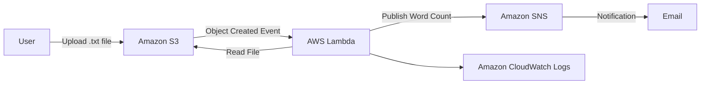
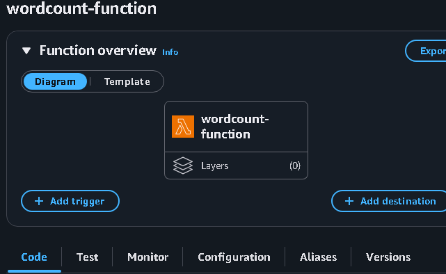
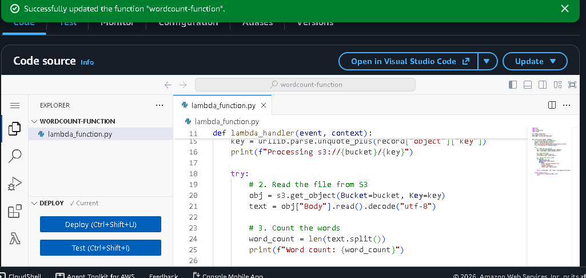
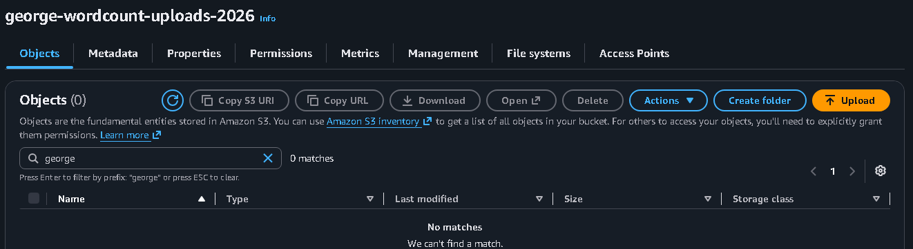
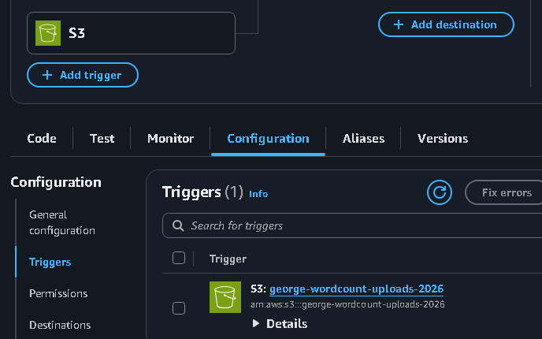
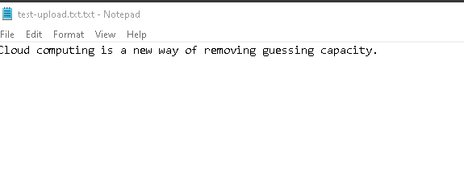
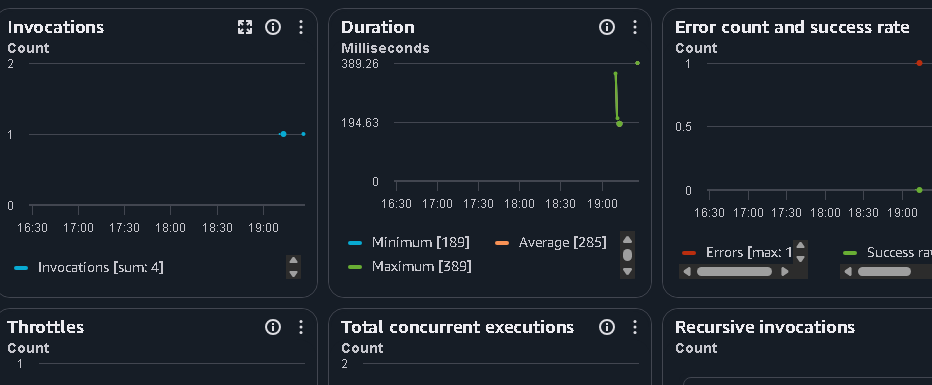
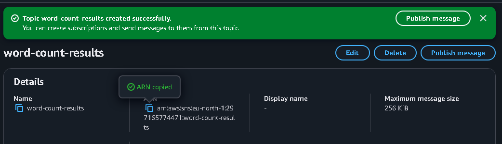
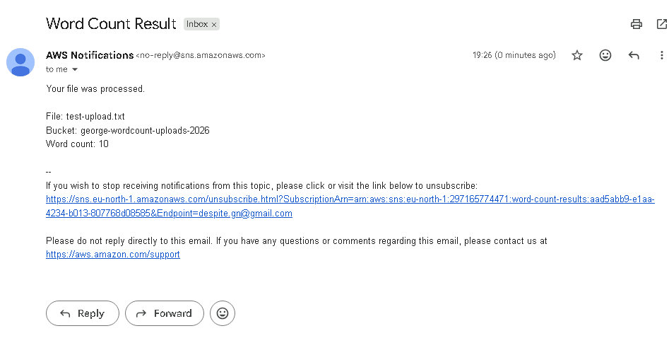

# Project 05 — AWS Lambda Word Counter

## Project Overview

This project demonstrates a **serverless, event-driven application** using AWS Lambda, Amazon S3, and Amazon SNS.

The project was completed as part of an **AWS re/Start hands-on challenge lab**. The solution automatically processes a text file uploaded to an Amazon S3 bucket, counts the words contained in the file using an AWS Lambda function, and sends the result through an Amazon SNS notification.

The project demonstrates how AWS services can be integrated to create an automated workflow without managing traditional application servers.

---

## Objectives

The objectives of this project were to:

* Create an AWS Lambda function.
* Write code to count the number of words in a text file.
* Create an Amazon S3 bucket for input files.
* Configure Amazon S3 to trigger the Lambda function when a file is uploaded.
* Retrieve the uploaded text file from S3 using Lambda.
* Process the contents of the file.
* Calculate the number of words.
* Publish the result using Amazon SNS.
* Configure an SNS notification endpoint.
* Test the complete serverless workflow.

---

## AWS Services Used

| AWS Service         | Purpose                                                        |
| ------------------- | -------------------------------------------------------------- |
| **AWS Lambda**      | Executes the word-count application code                       |
| **Amazon S3**       | Stores the input text file                                     |
| **Amazon SNS**      | Sends the word-count notification                              |
| **AWS IAM**         | Provides permissions between AWS services                      |
| **CloudWatch Logs** | Provides Lambda execution logs and troubleshooting information |

---

## Architecture



### Workflow

```text
User uploads text file
        ↓
Amazon S3
        ↓
S3 Object Created Event
        ↓
AWS Lambda
        ↓
Read text file
        ↓
Count words
        ↓
Amazon SNS
        ↓
Email notification
```

---

# Implementation

## 1. Create the Lambda Function

An AWS Lambda function was created to process the uploaded text file.

The Lambda function receives information about the S3 object that triggered the event and uses that information to identify the uploaded file.

The function then retrieves the object from the S3 bucket and processes its contents.

---

## 2. Implement the Word-Counting Logic

The Lambda function was configured to:

1. Receive the S3 event.
2. Identify the bucket.
3. Identify the uploaded object.
4. Retrieve the object from S3.
5. Read the text contents.
6. Count the words.
7. Publish the result to SNS.

A simplified representation of the logic is:

```python
# Receive S3 event
# Identify bucket and object
# Retrieve object
# Read file contents
# Count words
# Publish result through SNS
```

The actual Lambda implementation used in the lab is documented in the project evidence.

---

## 3. Create the S3 Bucket

An Amazon S3 bucket was created to store the input text file.

The bucket acts as the starting point of the automated workflow.

When a text file is uploaded, Amazon S3 generates an object-created event.

---

## 4. Configure the S3 Trigger

The S3 bucket was configured to invoke the Lambda function when a file was uploaded.

The event-driven relationship is:

```text
S3 Object Created
       ↓
Lambda Invocation
```

This eliminates the need for a user or application to manually execute the Lambda function after uploading the file.

---

## 5. Upload the Test File

A text file was uploaded to the configured S3 bucket.

The upload generated the event that initiated the Lambda function.

This provided the input data required for the word-count operation.

---

## 6. Lambda Execution

After the S3 upload event occurred, AWS Lambda executed the function.

The function:

* Retrieved the uploaded file.
* Read its contents.
* Counted the words.
* Prepared the result.
* Sent the result to the configured SNS topic.

Lambda execution information and logs can be used to verify that the function was invoked successfully.

---

## 7. Configure Amazon SNS

An Amazon SNS topic was configured to receive the word-count result from the Lambda function.

SNS provides a publish/subscribe messaging model that allows an application to publish a message to a topic and distribute that message to subscribed endpoints.

---

## 8. Email Notification

An email endpoint was configured as an SNS subscription.

After Lambda published the word-count result to the SNS topic, SNS delivered the notification to the subscribed email endpoint.

The completed workflow was therefore:

```text
S3 Upload
    ↓
Lambda Execution
    ↓
Word Count
    ↓
SNS Topic
    ↓
Email Notification
```

---

# Testing and Validation

The solution was tested by uploading a text file to the S3 bucket.

The following sequence was verified:

1. Text file uploaded to S3.
2. S3 generated an object-created event.
3. Lambda was invoked.
4. Lambda retrieved the file.
5. Lambda counted the words.
6. Lambda published the result to SNS.
7. SNS delivered the notification.
8. Email contained the resulting word-count information.

This validated the complete event-driven workflow.

---

# Permissions and Security

AWS IAM permissions are required for the services to interact securely.

The Lambda execution role needs appropriate permissions to perform the operations required by the function, such as:

* Reading objects from the S3 bucket.
* Publishing messages to the SNS topic.
* Writing execution information to CloudWatch Logs.

Permissions should follow the **principle of least privilege**, granting only the actions required by the application.

The S3 bucket and SNS resources should also be protected from unnecessary public access.

---

# Serverless Architecture

This project demonstrates the key characteristics of a serverless architecture.

### No Server Management

AWS Lambda executes the application code without requiring the user to provision or maintain an EC2 server for the application.

### Event-Driven Processing

The application responds automatically to an S3 object-created event.

### Automatic Scaling

Lambda can execute functions in response to incoming events without the user manually managing application servers.

### Managed Services

S3 and SNS provide managed storage and messaging capabilities.

---

# Key AWS Concepts Demonstrated

## AWS Lambda

AWS Lambda is a serverless compute service that runs code in response to events.

## Amazon S3 Events

S3 can generate events when objects are created or modified.

## Amazon SNS

SNS is a managed notification and messaging service that can distribute published messages to subscribers.

## IAM

IAM controls which AWS resources and actions the Lambda function is allowed to access.

## CloudWatch Logs

Lambda execution logs can be used to monitor and troubleshoot function execution.

## Event-Driven Architecture

The application responds to an event rather than requiring a user to manually execute each processing step.

---

# Cloud Practitioner Concepts

This project demonstrates practical understanding of:

* Serverless computing
* AWS Lambda
* Amazon S3
* Amazon SNS
* IAM permissions
* CloudWatch
* Event-driven architecture
* Managed AWS services
* Automation
* Application integration
* Cloud scalability
* Decoupled architecture

---

# Professional Skills Demonstrated

* Serverless application development
* AWS service integration
* Event-driven architecture
* Cloud automation
* IAM permission management
* S3 event configuration
* Lambda configuration
* SNS notification configuration
* Application troubleshooting
* Technical documentation

---

# Screenshots

The following screenshots document the implementation of the serverless word-count application.

## 1. Lambda Function



## 2. Lambda Code



## 3. S3 Bucket



## 4. S3 Trigger



## 5. Test File



## 6. Lambda Execution



## 7. SNS Topic



## 8. Email Result



---

# Lessons Learned

This project demonstrated how multiple AWS managed services can be combined to create an automated application workflow.

The main lessons were:

* S3 can act as an event source for Lambda.
* Lambda can process files without requiring a dedicated server.
* IAM permissions are essential for service-to-service communication.
* SNS can distribute application results to subscribers.
* CloudWatch Logs are useful for troubleshooting Lambda executions.
* Event-driven architectures can reduce manual intervention.
* Managed services can be combined to create loosely coupled cloud applications.

---

# Possible Improvements

A production-oriented version of this application could include:

* Input validation for uploaded files.
* Handling multiple file formats.
* Dead-letter queues for failed processing.
* More detailed error handling.
* CloudWatch alarms.
* Structured logging.
* AWS X-Ray tracing.
* Infrastructure deployment using AWS CloudFormation.
* Automated testing.
* A separate S3 bucket for processed files.
* Storage of processing results in DynamoDB.

---

# Project Status

**Completed**

This project demonstrates hands-on experience building a **serverless, event-driven AWS workflow using Amazon S3, AWS Lambda, Amazon SNS, IAM, and CloudWatch**.

