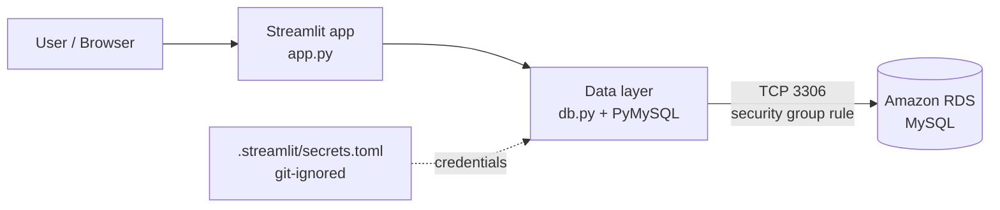

# 🗂️ Mini Database: Python CRUD App on Amazon RDS

A web app that performs full CRUD operations (Create, Read, Update, Delete) plus search against a managed **Amazon RDS MySQL** database. Built with Python and Streamlit.

The project started as a ~150-line command-line database using only lists and dictionaries, then evolved into a web app, and finally into a cloud-backed application with real persistence.

---

## 📌 Project Overview

| | |
|---|---|
| **Goal** | Understand the core ideas behind data management systems, then connect them to a real cloud database |
| **Frontend** | Streamlit (runs in the browser, works on mobile) |
| **Backend** | Amazon RDS for MySQL |
| **Language** | Python 3 |
| **DB driver** | PyMySQL |

## 🏗️ Architecture



## ✨ Features

- **Create**: add records through a form
- **Read**: view all records in a table, or look up one by id
- **Update**: pick a record and edit its fields
- **Delete**: remove a record by id
- **Search**: filter by name (partial match), role, or city
- **Persistent**: data lives in RDS, so it survives restarts and browser sessions

## 🧱 Project Structure

```
mini-database-rds-app/
├── app.py                      # Streamlit UI (5 tabs: Create / View / Update / Delete / Search)
├── db.py                       # RDS connection + CRUD functions (PyMySQL)
├── sql/
│   └── schema.sql              # Database + table creation
├── evolution/
│   ├── 01_mini_database_cli.py # Stage 1: in-memory CLI version (lists + dicts)
│   └── 02_app_in_memory.py     # Stage 2: Streamlit UI with session_state storage
├── .streamlit/
│   └── secrets.toml.example    # Credentials template (real file is git-ignored)
├── screenshots/                # Documentation screenshots
├── requirements.txt
└── .gitignore
```

## 🔄 How the Project Evolved

1. **CLI version** (`evolution/01_mini_database_cli.py`): a list of dictionaries acts as the "table", with functions for create, read, update, delete and search, and a text menu.
2. **Web version** (`evolution/02_app_in_memory.py`): the same logic wrapped in a Streamlit UI. Data lives in `st.session_state`, so it disappears on restart.
3. **Cloud version** (`app.py` + `db.py`): storage swapped for Amazon RDS MySQL. The UI stays almost the same; only the data layer changes.

## 🚀 Setup & Run

### 1. Prerequisites
- Python 3.9+
- An Amazon RDS MySQL instance that is **Available**
- A security group inbound rule allowing **MySQL/Aurora (port 3306)** from the machine running the app

### 2. Create the database and table
Connect to your RDS instance with the `mysql` client and run:

```bash
mysql -h <your-rds-endpoint> -u <user> -p < sql/schema.sql
```

### 3. Configure credentials
```bash
cp .streamlit/secrets.toml.example .streamlit/secrets.toml
# then edit secrets.toml with your endpoint, user, and password
```

### 4. Install and run
```bash
pip install -r requirements.txt
streamlit run app.py
```

The app opens at `http://localhost:8501`.

## 🔐 Security Notes

- **Credentials are never committed.** They live in `.streamlit/secrets.toml`, which is listed in `.gitignore`.
- **Parameterized queries.** Every SQL statement in `db.py` uses `%s` placeholders instead of string formatting, which protects against SQL injection.
- **Least privilege.** `sql/schema.sql` includes an optional dedicated `mini_app` user with only `SELECT, INSERT, UPDATE, DELETE` on this database, rather than using the RDS master user.
- **Network access.** The security group should allow port 3306 only from trusted IPs. Hosting on Streamlit Community Cloud requires `0.0.0.0/0` because its IPs aren't fixed, which is acceptable for a demo only. For anything real, use a VPN, bastion host, or IAM database authentication.

## 📸 Screenshots

| RDS instance | Security group |
|---|---|
|  |  |

| Table created | Create record |
|---|---|
|  |  |

| View all | Update / Search |
|---|---|
|  |  |

| Delete | Verified in RDS |
|---|---|
|  |  |

## 🎓 Key Takeaways

- CRUD operations map directly onto SQL: `INSERT`, `SELECT`, `UPDATE`, `DELETE`
- Separating the UI (`app.py`) from the data layer (`db.py`) made swapping in-memory storage for RDS a small change
- Managed databases need both network configuration (security groups) and secrets management, not just code
- Parameterized queries are non-negotiable when user input reaches SQL

## 🔭 Possible Improvements

- Connection pooling instead of opening a connection per operation
- Input validation and duplicate detection
- Pagination for large tables
- IAM database authentication and RDS in a private subnet
- Deploy on EC2 in the same VPC as RDS, so 3306 never needs public exposure
- Unit tests for `db.py`

## 🛠️ Tech Stack

`Python` · `Streamlit` · `PyMySQL` · `pandas` · `Amazon RDS (MySQL)` · `AWS Security Groups`
